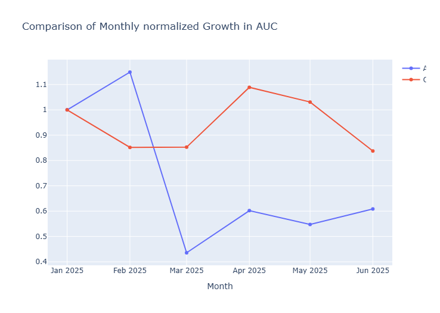
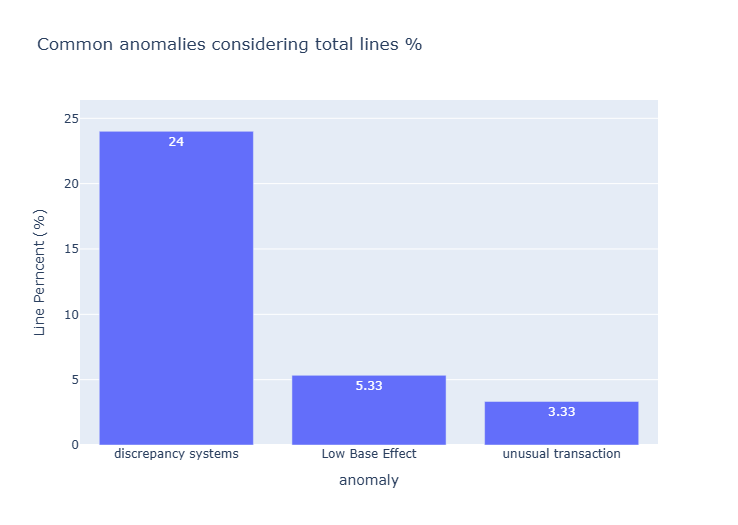
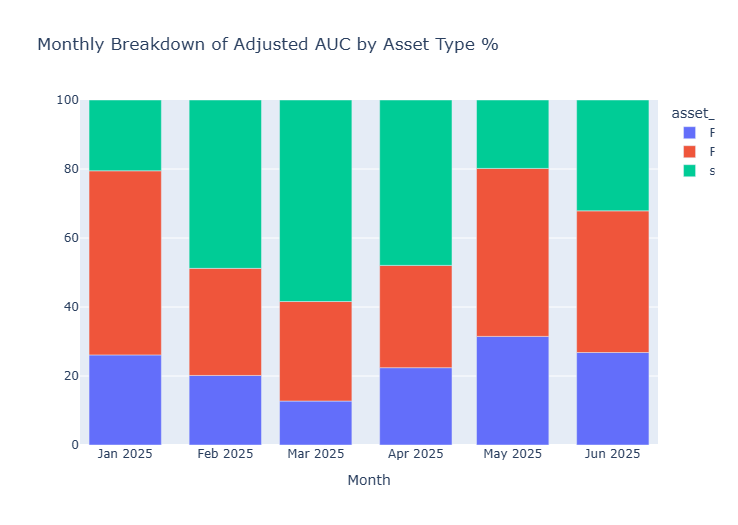

# AUC Consistency Analysis in Banking

##  Overview

This project analyzes inconsistencies across financial data sources to build a reliable **Assets Under Custody (AUC)** metric.

In real-world financial systems, discrepancies between custody, accounting, and transactional data can lead to inaccurate reporting and poor decision-making. This project simulates such a scenario and proposes a structured approach to detect anomalies, validate data consistency,  analyze asset evolution and compare with simulated datas competitor.

---

##  Objectives

* Identify inconsistencies between custody and accounting balances
* Detect anomalous transaction patterns
* Build a robust proxy for AUC in the presence of data issues
* Analyze monthly asset evolution
* Compare growth trends with a simulated competitor

---

##  Data Source

The dataset was **synthetically generated using SQL scripts** to simulate a financial environment, including:

* Transaction data (cash inflows and outflows)
* Custody balances (assets held)
* Accounting balances

The workflow follows:

**SQL → CSV → Python analysis**

AI-assisted tools were used to accelerate SQL generation, while all modeling logic and validation rules were manually defined.

---

##  Methodology

### 1. Exploratory Data Analysis

Initial analysis was performed to understand:

* Data distribution
* Presence of negative values
* Divergence between custody and accounting balances

---

### 2. Feature Engineering

New metrics were created to support anomaly detection:

* Daily percentage variation of balances
* Ratio between transaction volume and prior balance
* Absolute and relative differences between sources

---

### 3. Anomaly Detection

Anomalies were classified based on three main criteria:

* **System Inconsistency**

  * Custody and accounting balances have opposite signs
  * OR difference exceeds 10% and absolute threshold

* **Movement Anomaly**

  * Transaction volume above the 95th percentile
  * Indicates unusual activity relative to balance

* **Low Base Effect**

  * Distortions caused by very small balance values
  * Identified using the 5th percentile threshold

---

##  AUC Construction

An adjusted AUC metric was created using the following logic:

1. Prioritize custody balance when consistent
2. Use accounting balance when custody is unreliable
3. Exclude cases where both sources are inconsistent

> Transaction values were **not used as AUC proxies**, as they represent flow rather than stock.

---

##  Analysis

### Monthly AUC Evolution



The analysis shows variations over time, including abrupt changes that may reflect data inconsistencies or shifts in asset allocation.
In addition to tracking the month-over-month growth of assets under custody, it is possible to compare this growth with that of competitors in order to identify trends and assess the institution’s market position

---

### Anomaly Distribution



* ~27% of records contain anomalies
* Majority are system inconsistencies
* Indicates potential integration issues between data sources

---

### Asset Composition



The composition analysis highlights how different asset classes contribute to total AUC over time, revealing shifts in portfolio structure.

---

### Comparison with Competitor

A comparison was performed using simulated public data.

Due to the absence of structural data (e.g., number of clients), values were **normalized** to allow comparison of growth trends rather than absolute values.

---

##  Key Insights

* High level of inconsistency between custody and accounting systems
* Accounting balance shows greater volatility
* Significant presence of anomalies (~27% of records)
* Data quality issues directly impact AUC reliability
* Asset composition varies significantly over time

---

##  Limitations

* Synthetic dataset (not real financial data)
* High proportion of inconsistent records
* Simplified AUC reconstruction logic
* Competitor comparison not normalized by client base
* Absence of market pricing (no mark-to-market valuation)

---

##  How to Run

### 1. Generate Data (SQL)

Execute the SQL scripts located in:

```bash
sql/
```

* `01_create_tables.sql`
* `02_generate_data.sql`
* `03_queries_analysis.sql`

---

### 2. Export Data

Export the generated tables to CSV format.

---

### 3. Run Analysis

Open the notebook:

```bash
notebooks/auc_analysis.ipynb
```

Run all cells to reproduce the analysis.

---

### 4. Install Dependencies

```bash
pip install -r requirements.txt
```

---

##  Technologies Used

* Python
* Pandas
* NumPy
* Plotly
* SQL

---

##  Project Structure

```plaintext
auc-consistency-analysis-banking/
│
├── README.md
├── requirements.txt
│
├── notebooks/
│   └── auc_analysis.ipynb
│
├── sql/
│   ├── 01_create_tables.sql
│   ├── 02_generate_data.sql
│   ├── 03_queries_analysis.sql
│
├── images/
│   ├── auc_evolution.png
│   ├── anomaly_distribution.png
│   └── asset_composition.png
```

---

##  Conclusion

This project demonstrates how to handle inconsistent financial data and build meaningful analytical insights despite data quality challenges.

The approach emphasizes:

* Data validation
* Clear anomaly definition
* Business-oriented interpretation

Ultimately, reliable financial analysis depends not only on models, but on the **quality and consistency of underlying data**.

---
